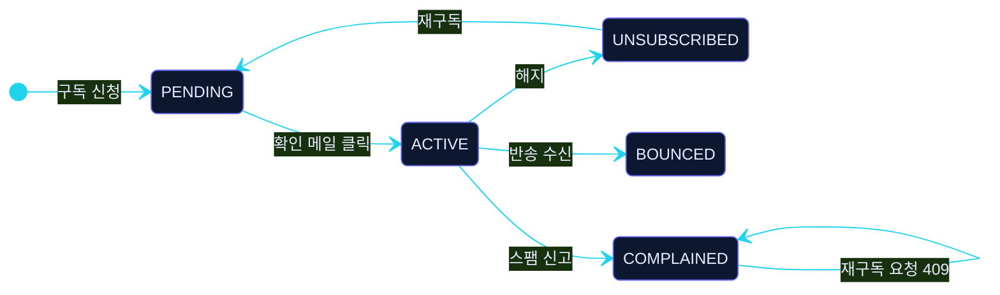
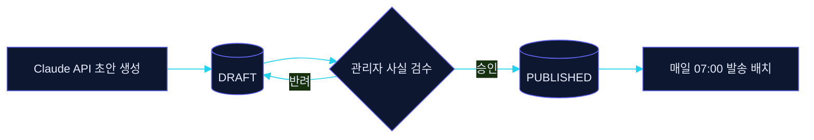

<div align="center">



<br/><br/>

<a href="https://dailyq.me"></a>
<a href="https://www.kimjiyun.site/"></a>


</div>

<br/>

> **삭제 대신 상태 전이.** 실패도 이름을 가진 상태로 남겨야 추적할 수 있다고 믿습니다.
> **도구는 필요할 때만.** 넣지 않기로 한 이유도 ADR에 남깁니다.
> **자동화 앞에는 게이트.** AI가 만든 것은 예외 없이 `DRAFT`에서 시작합니다.

<br/>

## ◆ Now Running — [DailyQ](https://dailyq.me)

기술 면접 질문을 매일 아침 메일로 보내는 구독 서비스. 기획·설계·구현·인프라·운영을 **혼자** 합니다.

`질문 240개 검수 완료` `매일 07:00 자동 발송` `ADR 7건` `커밋 49건 / 11일` `모노레포 4파트`

> 시작은 사고였습니다. SES 샌드박스 제한으로 발송이 막혔는데 요약 로그가 없어 **이틀간 몰랐습니다.**
> 그 뒤로 "조용히 실패하지 않는 구조"를 기준으로 전부 다시 설계했습니다.

### 구독 상태 머신



### 설계 결정과 이유

| 결정 | 왜 |
|---|---|
| 해지를 행 삭제가 아닌 **상태 전이**로 | 재구독·반송·신고 이력을 잃지 않고 추적하기 위해 |
| `COMPLAINED` 재구독은 **409 + 사유 비노출** | 타인이 남의 주소로 신고 이력을 조회할 수 있는 경로였기 때문 |
| 반송·신고 피드백을 **SNS → SQS → 폴링**으로 수신 | 중복은 UNIQUE 제약, 누락은 `status` + 커서 — 실패 모드별로 방어를 분리 |
| LLM 결과는 예외 없이 **`DRAFT` 저장** | 테스트에서 없는 개념을 만들어내는 환각이 나왔고, 검수 없이 나가는 경로를 없애야 했음 |
| **Spring Batch 도입 보류** | 필요한 건 커서 하나였음 — 대신 이관 매핑 경로만 ADR에 기록 |

<details>
<summary><b>콘텐츠 파이프라인 · 인프라 구성 보기</b></summary>

<br/>



발송 배치의 조회 조건을 `PUBLISHED`로 고정해, **미검수 콘텐츠는 구조적으로 발송될 수 없게** 만들었습니다.

**Infra** — EC2 `t2.micro` + RDS MySQL 8 + SES(SPF·DKIM·DMARC, 프로덕션 액세스 승인) · 프론트 Vercel
**Repo** — `backend` Java 21 / Spring Boot 3.x / JPA · `frontend` Next.js 15 / TS · `content-pipeline` Node / Claude API · `docs·deploy` ADR 7건 + 배포 런북 + AGENTS.md

</details>

<br/>

## ◆ Stack

|  |  |
|---|---|
| **Language** |     |
| **Frontend** |     |
| **Backend** |    |
| **Data · Infra** |    |

<br/>

## ◆ Projects

| | |
|---|---|
| [**DailyQ**](https://dailyq.me) | 기술 면접 질문 메일 구독 · 1인 풀스택 설계/운영 &nbsp;`Spring Boot` `Next.js` `AWS` |
| [**discord-time-checker**](https://github.com/kirnjiyun/discord-time-checker) | 16인 스터디 화면공유 타임체크 봇 · 실사용 중 &nbsp;`TypeScript` `Node.js` |
| [**jiyunFrontPortfolio-FE**](https://github.com/kirnjiyun/jiyunFrontPortfolio-FE) | 포트폴리오 사이트 kimjiyun.site &nbsp;`Next.js` `TypeScript` |
| [**shinhan-java**](https://github.com/kirnjiyun/shinhan-java) | 백엔드 확장을 위한 Java/Spring 학습 기록 &nbsp;`Java` |
| [mirujima_FE](https://github.com/FESI-7-4/mirujima_FE) | 콘텐츠를 할 일로 관리하는 서비스 · 팀 프로젝트 &nbsp;`TypeScript` |
| [web-como](https://github.com/Findev-omo/web-como) | 동호회 임원/주무부서 관리센터 웹 · 팀 프로젝트 &nbsp;`TypeScript` |

<br/>

## ◆ Building Next

```
2026 Q4  ├─ 모임통장 + 자동 정산 · Spring Boot + Vue
         │  회비 수금 → 지출 기록 → 월말 N분할 자동 정산
         │  영수증 사진 자동 기록 · "이번 달 정산 돌려줘" 자연어 에이전트
         │
         └─ 도메인 지식 RAG 어시스턴트
            공개 규정만으로 코퍼스 구성 · 골든셋 60문항 회귀 평가
            모르는 영역은 '확인 필요'로 표시하는 가정 등록부 운영
```

<br/>

</div>
